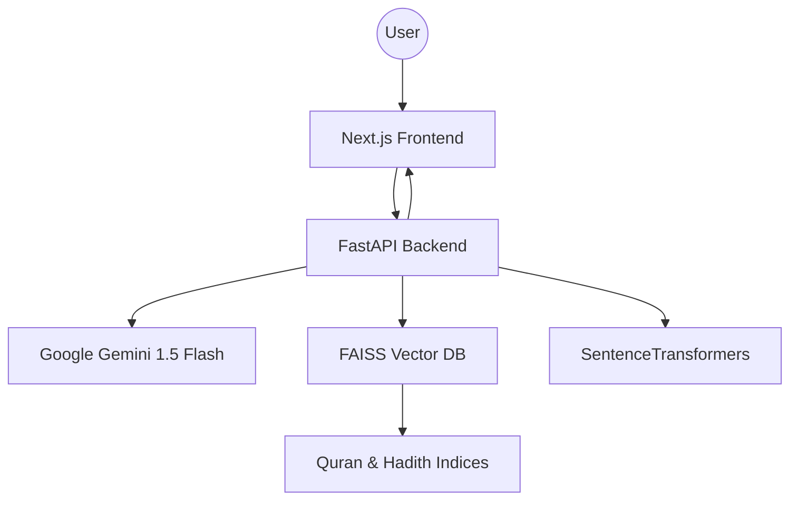

<p align="center">
  
</p>

<h1 align="center">🕌 HidayahAI: Islamic Truth Verification System</h1>

<p align="center">
  
  
  
  
  
</p>

---

## 🌟 Project Overview

**HidayahAI** is a state-of-the-art web application that leverages advanced AI and authentic Islamic sources to provide clear, referenced answers to your questions about Islam. Using a Retrieval-Augmented Generation (RAG) pipeline, HidayahAI searches the Quran and Sahih Hadith collections, returning reliable, evidence-based responses with direct links to [Quran.com](https://quran.com) and [Sunnah.com](https://sunnah.com).

---

## 🛠️ Technical Stack

- **Backend:** FastAPI (Python)
- **Frontend:** Next.js (React), with a supernatural/spiritual Islamic UI theme
- **Language Model:** Google Gemini 1.5 Flash
- **Vector Database:** FAISS for fast embedding search
- **Embeddings:** Sentence-Transformers (`all-MiniLM-L6-v2`)
- **APIs:** Links to Quran and Hadith via [quran.com](https://quran.com) and [sunnah.com](https://sunnah.com)

---

## ✨ Key Features

- **Authentic Answers:** All responses are directly referenced from Quran and Sahih Hadith.
- **Automatic Reference Linking:** Inline citations with clickable links to original sources.
- **Multilingual Support:** Ask questions in English or Urdu.
- **Flexible Source Selection:** Filter answers by Quran only, Hadith only, or both.
- **Alternative Term Search:** If no direct match is found, the system suggests close terms or related concepts.
- **Proper Citation:** Answers are transparently sourced, with clear, formatted citations.

---

## 🏗️ Architecture



1. **FastAPI Backend**: Orchestrates the RAG pipeline, processes queries, retrieves evidence, and generates responses.
2. **Next.js Frontend**: Provides a beautiful, spiritual Islamic interface for users.

---

## 🚀 Getting Started

### 1. Prerequisites

- Python 3.9+
- Node.js 18+
- [Google Gemini API Key](https://aistudio.google.com/app/apikey)
- Precomputed FAISS indices for Quran and Hadith
- [SentenceTransformers](https://www.sbert.net/)
- [FAISS](https://github.com/facebookresearch/faiss)

### 2. Installation

#### Backend (FastAPI)

```bash
git clone https://github.com/Wasif-Sohail55/HidayahAI.git
cd HidayahAI/backend
python -m venv venv
source venv/bin/activate  # on Windows: venv\Scripts\activate
pip install -r requirements.txt
export GEMINI_API_KEY=your_google_gemini_api_key
# Download or place FAISS indices in the designated data/ directory
uvicorn main:app --reload
```

#### Frontend (Next.js)

```bash
cd ../frontend
npm install
# Configure .env.local for API endpoints if needed
npm run dev
```

### 3. Configuration

- Place your precomputed FAISS indices and source texts (Quran & Hadith) in the `/data` directory.
- Update environment variables as needed.

---

## 💡 Usage Examples

### Simple Query

> **Q:** What is the significance of prayer in Islam?  
> **A:**  
> “Establish regular prayer; for prayer restrains from shameful and unjust deeds...”  
> — [Quran 29:45](https://quran.com/29/45)

### Ask about a Specific Verse

> **Q:** What does the Quran say about patience?  
> **A:**  
> “O you who have believed, seek help through patience and prayer...”  
> — [Quran 2:153](https://quran.com/2/153)

### Hadith Reference

> **Q:** Is intention required for every action?  
> **A:**  
> “Actions are but by intentions...”  
> — [Sahih Bukhari 1](https://sunnah.com/bukhari:1)

### Complex Question

> **Q:** Can you explain the Islamic view on forgiveness?  
> **A:**  
> “Let them pardon and overlook. Would you not like that Allah should forgive you?”  
> — [Quran 24:22](https://quran.com/24/22)  
> “Whoever does not show mercy will not be shown mercy.”  
> — [Sahih Muslim 2318](https://sunnah.com/muslim:2318)

---

## 🖼️ Screenshots

<p align="center">
  
  <br>
  
</p>

---

## 📚 API Documentation

See the [API Docs](./backend/docs) (served via FastAPI Swagger UI at `/docs`).

---

## 🤝 Contributing

We welcome contributions from the community!

1. Fork the repository
2. Create a new branch (`git checkout -b feature/your-feature`)
3. Commit your changes (`git commit -m 'Add amazing feature'`)
4. Push to the branch (`git push origin feature/your-feature`)
5. Create a Pull Request

Please read our [CONTRIBUTING.md](./CONTRIBUTING.md) for full guidelines.

---

## 🕋 Islamic-Themed Badges

<p align="center">
  
  
</p>

---

## 📝 License

Distributed under the MIT License. See [LICENSE](./LICENSE) for more information.

---

<p align="center" dir="rtl">
  بِسْمِ اللَّهِ الرَّحْمَنِ الرَّحِيمِ  
</p>

<p align="center">
  <i>“And say: My Lord, increase me in knowledge.”</i> <br/>
  <b>— Quran 20:114</b>
</p>
